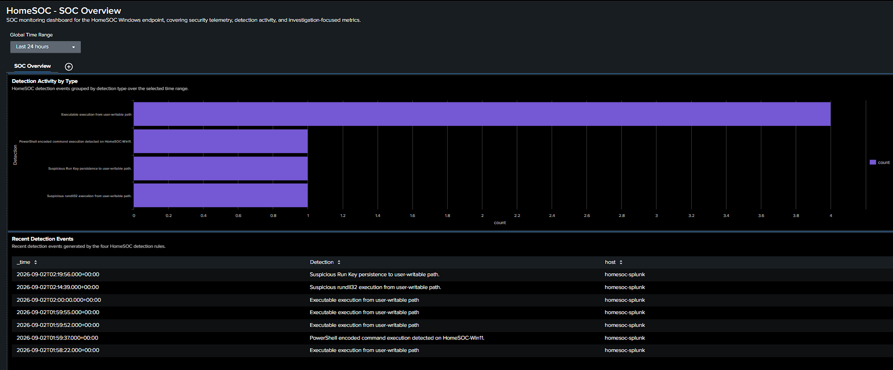

# Splunk SOC Detection Lab

Hands-on Windows SOC lab focused on SIEM monitoring, detection engineering, real-time alerting, and investigation.

## Stack

Windows 11, Sysmon, Splunk Enterprise, Splunk Universal Forwarder, SPL, MITRE ATT&CK

## Architecture

Windows Endpoint → Sysmon → Universal Forwarder → Splunk Enterprise → Detections → Alerts → Investigation

## Detections

| Detection | ATT&CK |
|---|---|
| [PowerShell Encoded Command Execution](detections/01-powershell-encoded) | T1059.001 |
| [Suspicious Rundll32 Execution](detections/02-rundll32-user-writable) | T1218.011 |
| [Run Key Persistence](detections/03-runkey-persistence) | T1547.001 |
| [User-Writable Executable Execution](detections/04-user-writable-executable) | Behavioral detection |

## Dashboard

## Investigations

[PowerShell Encoded Command](investigations/01-powershell-encoded) · [Rundll32](investigations/02-rundll32) · [Run Key Persistence](investigations/03-runkey-persistence) · [User-Writable Executable](investigations/04-user-writable-executable)

## What This Demonstrates

Windows endpoint telemetry, SPL detection development and tuning, real-time alerting, process and persistence investigation, false-positive analysis, MITRE ATT&CK mapping, and SOC dashboarding.

## Validation

Four detections were tested with controlled lab activity and verified through Sysmon telemetry, Splunk searches, and real-time alerts.

## Documentation

[MITRE Mapping](docs/mitre-mapping.md) · [Deployment](docs/deployment.md) · [Detection Tuning](docs/detection-tuning.md) · [Final QA](docs/final-qa.md)

> Controlled home lab environment. Test activity is benign.
