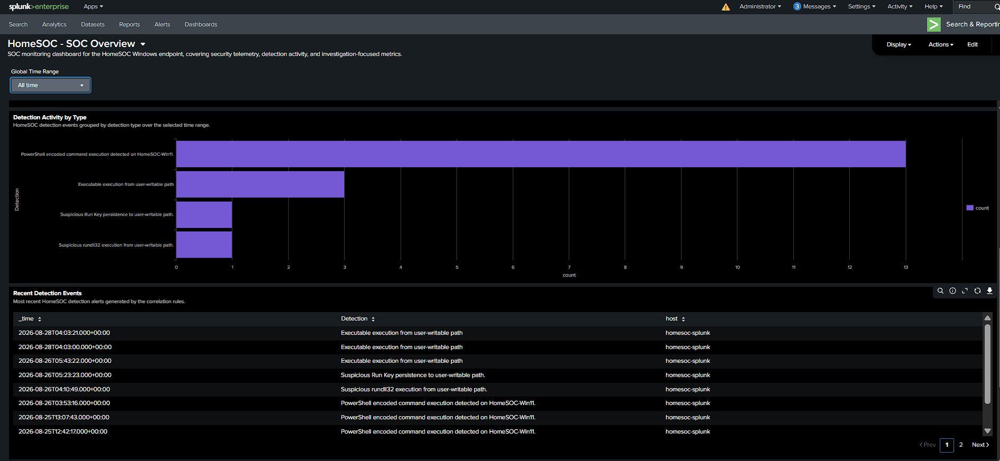

# Splunk SOC Detection Lab

Hands-on Windows SOC lab focused on SIEM monitoring, detection engineering, alerting, and investigation.

## Stack

Windows 11, Sysmon, Splunk Enterprise, Splunk Universal Forwarder, SPL, MITRE ATT&CK

## Architecture

Windows Endpoint → Sysmon → Universal Forwarder → Splunk Enterprise → Detections → Alerts → Investigation

## Detections

| Detection | ATT&CK |
|---|---|
| [PowerShell Encoded Command Execution](detections/01-powershell-encoded) | T1059.001 |
| [Suspicious Rundll32 Execution](detections/02-rundll32-user-writable) | T1218.011 |
| [Run Key Persistence](detections/03-runkey-persistence) | T1547.001 |
| [User-Writable Executable Execution](detections/04-user-writable-executable) | Behavioral detection |

## What This Demonstrates

Windows endpoint telemetry collection, SPL detection development and tuning, real-time alerting, process and persistence investigation, false-positive analysis, MITRE ATT&CK mapping, and SOC dashboarding.

## Dashboard

## Validation

Each detection was tested with controlled lab activity and verified through Sysmon telemetry, Splunk searches, and real-time alerts.

## Evidence

Detection logic, investigation case studies, dashboard evidence, and supporting documentation are included in the repository.

> Controlled home lab environment. Test activity is benign.
